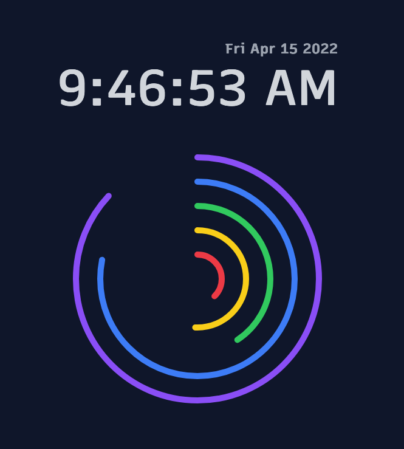

# Concentric Time

A simple and fun way to view the time!

---

## Screenshots

#### Dark mode

#### Light mode

---

## Dev

This project uses [Leptos](https://leptos.dev/) (a Rust-Wasm framework) and does also require Node to run the [Tailwind](https://tailwindcss.com/) CLI behind the scenes to build the stylesheet.

In a terminal run `trunk serve` which bundles the assets and serves at [localhost:8080](http://localhost:8080). Pass the `--open` flag to open the browser tab automatically.

## Release

Build the app with `trunk build --release`. Build locally and then merging to `main` will push the web assets to the hosting provider.
